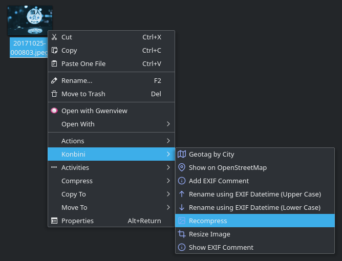

# Konbini :cherry_blossom: コンビニコンビニ

A set of Bash shell scripts and desktop files that add useful context actions to the Dolphin browser. The accompanying installer Bash shell script automatically installs and configures all the required components. Konbini includes the following actions and scripts:

- [Photo Funnel](https://gitlab.com/dmpop/photo-funnel) is a simple graphical tool for importing, geotagging, and organizing photos and raw files. Run using the `pf` command.
- *Geotag and Add Info* is a script that geotags selected photos and writes camera info and weather condtions on the day each photo was taken to the *Comment* field in EXIF metadata. Use the `geotag-addinfo` command to run the script. During the first run provide the required information. When prompted, add the desired photos and press **Continue**. Specify the city or country where the photos were taken and press **OK**.
- *Add Info* is similar to the *Geotag and Add Info* script, except it adds camera info and weather conditions to already geotagged photos.
- [Highrise](https://gitlab.com/dmpop/highrise) is a Bash shell script for generating super-resolution images from a stack of lower-resolution photos. Run using the `highrise -e [EXT] -d [DIR]` command. Replace `[EXT]` with the file extension of the source photos (e.g., *JPG* or *jpg*) and `[DIR]` with the absolute path to the directory containing source photos.
- *Unbash* is a script for fetching Unsplash photos matching the specified keyword. Run using the `unbash -c [NUMBER] -k [KEYWORD]` command.
- *Geotag by City* geotags photos. Right-click on the desired photo, choose **Konbini → Geotag by City**.
- *Show on OpenStreetMap* shows the position of the specified geotagged photo on the OpenStreetMap. Right-click on the desired photo, choose **Konbini → Show on OpenStreetMap**.
- *Resize*, a tool for resizing images using ImageMagick. Right-click on the desired photo, choose **Konbini → Resize**.
- *Rename (Lower Case)* renames photos using the jhead tool and change the file extension to lower case. The tool renames photos using the *YYYYMMDD-hhmmss* format (e.g., *19701101-115530*). Right-click on the desired photo, choose **Konbini → Rename using EXIF Datetime (Lower Case)**.
- *Rename (Upper Case)* renames photos using the jhead tool and change the file extension to upper case. The tool renames photos using the *YYYYMMDD-hhmmss* format (e.g., *19701101-115530*). Right-click on the desired photo, choose **Konbini → Rename using EXIF Datetime (Upper Case)**.
- *Recompress* recompresses photos using the jpeg-recompress tool.
- [Expose](https://github.com/Jack000/Expose) is a tool for generating static photo galleries. Switch to a directory contaning photos you want to publish and run the `expose` command.

## Installation

Run the `curl -sSL https://is.gd/konbini | bash` command.
